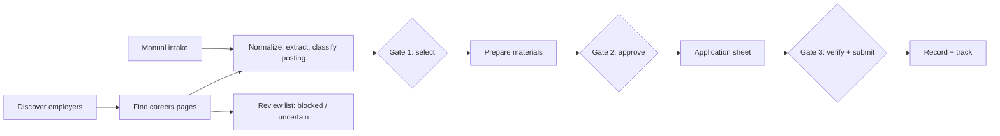
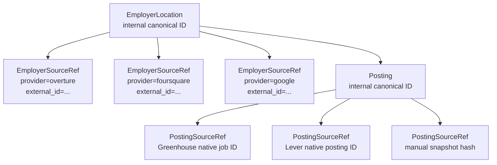
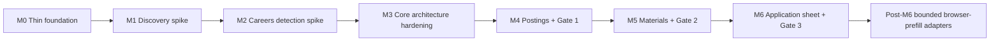

# Assisted Job Application Pipeline: Engineering Plan

> **How this gets built.** Scope, stage design, milestones, acceptance criteria, and engineering
> standards. What the product is and will not do is [the product overview](00-product-overview.md);
> open questions are in [the investigations](02-deferred-investigations.md); what changed and why
> is in [the review log](03-review-log.md).
>
> **Revision:** 2026-09-20  |  **Owner:** _unassigned - set before M0_

## Project goal

Build a tool that finds front-of-house restaurant openings near a chosen location and prepares every application, leaving the applicant only judgment calls, human-verification steps, and final submission.

**Problem.** Applying by hand means scanning maps, visiting employer websites, finding careers pages, and reworking application materials for each posting. Most of that effort goes to searching, navigation, and reformatting rather than deciding where to apply.

**Goal.** Automate every step that can be performed reliably and within each source's rules. Route the remaining work to the applicant at three defined human gates, at any verification challenge, and at final submission.

### Success criteria for the first build

| **Criterion**          | **Acceptance target**                                                                                                                                                                                                                                                  |
|------------------------|------------------------------------------------------------------------------------------------------------------------------------------------------------------------------------------------------------------------------------------------------------------------|
| Pilot run              | Every automated stage between human gates completes without operator intervention, or produces an explicit review or dead-letter outcome. A pilot run produces the Gate 1 posting table and, after approvals, an application sheet.                                    |
| Employer coverage      | Known-employer recall is at or above 80% against an answer key randomly sampled from an independent frame, reported with its Wilson interval and sample size. The applicant's recalled list is reported separately as a relevance check and never pooled with it.                                                                                                                                                                                                 |
| Discovery accounting   | Every employer returned by the M1 pilot is classified as eligible, closed, duplicate, wrong-category, outside-radius, junk/unverifiable, or eligible-without-website. Counts are recorded. A numeric noise threshold is set only after the pilot baseline exists.      |
| Careers page safety    | Every employer in the 30-employer answer key ends in exactly one outcome, with the key split into a dev set for tuning and a holdout reported once. No known hiring path is silently classified as None found. Blocked, uncertain, and unreachable outcomes route to review.                                                                     |
| Posting extraction     | On the fixed hand-checked posting fixture created in M4, no eligible posting is silently dropped; unclassified titles appear at Gate 1 with a flag.                                                                                                                    |
| Duplicate applications | Zero application lineages to the same canonical posting without a deliberate Resubmit.                                                                                                                                                                                 |
| Materials quality      | Approved documents pass the selected style profile, global output constraints, and claim checks. Every generated claim traces to a confirmed fact, and every applicant edit is either unchanged from an approved render or explicitly attested.                       |
| Submission safety      | No submit-capable code path ships. The first build contains no browser worker, and a CI check asserts that no adapter exposes a submit, click-to-submit, or form-post operation. The prefill handoff test is the entry gate for post-M6 prefill work, not a first-build criterion. |
| Applicant effort       | Each run accepts a maximum application count, a total time budget, and a per-application time target. Pipeline time and third-party form time are measured separately and reported as n, median, min, and max. The user chooses which time scope counts against the run budget. |

## Scope

The first build covers server, host, and busser roles around ZIP 94085, from employer discovery through a completed application record.

| **Area**           | **First build**                                                                                     | **Later feature pushes**                                                                                             |
|--------------------|-----------------------------------------------------------------------------------------------------|----------------------------------------------------------------------------------------------------------------------|
| Job types          | Server, host, busser                                                                                | Delivery driver, receptionist, tutor, teacher's assistant, dog walker                                                |
| Employer discovery | Overture Maps Places                                                                                | Foursquare Open Source Places; Google Places as a paid fallback                                                      |
| Posting discovery  | Careers pages, public hiring-platform APIs, manual intake                                           | Aggregator APIs, web search API, browser-assisted posting capture                                                    |
| Selection          | Hard filters with volume or priority mode; configurable application and time budgets                | Learned preferences; approval by policy                                                                              |
| Gate 1             | Pre-checked posting table with stars, or automatic selection                                        | AI-suggested selections                                                                                              |
| Knowledge          | Base resume, base cover letter, experience file, timeline; fact confirmation                        | Autobiography and other free-form extraction                                                                         |
| Materials          | Word templates, PDF export, versioned style profiles, style linter, claim checks, approved variants | Resume and cover-letter writer models; per-posting tailoring                                                         |
| Application        | Application sheet. Browser prefill is not required for first-build completion.                      | Bounded per-platform browser-prefill sessions, then broader assisted sessions only after portal-specific tests exist |
| Tracking           | Manual response marking; application records; decision log                                          | Email reading that suggests matches for confirmation                                                                 |

### Non-goals for the first build

- Evading bot detection, solving CAPTCHAs automatically, or ignoring robots.txt.

- Submitting any application without the applicant pressing submit.

- Automated access to Indeed or any source whose terms prohibit it.

- Supporting more than one applicant.

- Selecting, calling, or fine-tuning a language model.

- General autonomous browser operation across unknown portals.

## Operating principles

**Automate legitimate, reliable work.** Automate everything the system can do reliably and legitimately; route only the steps that need a person to the applicant.

**Bot-assisted, human-completed.** The system searches, reads, filters, drafts, and may prefill approved fields. The applicant makes gate decisions, completes verification, and presses submit.

**Challenges go to the human.** When a site asks for a CAPTCHA, verification code, login decision, or attestation, the system pauses and hands over. It never solves, bypasses, or disguises its way past a challenge.

**Rules first.** The crawler identifies itself where appropriate, obeys robots.txt and crawl delays, limits its request rate per domain, and does not automate restricted sources. A source policy file holds allow and deny lists. An unlisted source is shown for review and always handed off rather than prefilled.

**One application per posting.** A second application happens only when the applicant presses Resubmit.

**Accuracy over polish.** Materials use only facts the applicant has confirmed. Untraceable objective claims are flagged rather than invented.

**Replayable automation.** Automated stages are safely retryable. A stage commits one logical output for a specific input fingerprint.

**Untrusted web input.** Employer URLs, redirects, pages, and downloads are untrusted input. Network and browser adapters validate destinations and isolate remote content from the local machine.

**Works the first time.** First-build features use dependable techniques. Riskier automation waits until the deterministic core is reliable.

**Configuration over code.** Job types, search modes, selection rules, run budgets, and style profiles live in configuration files.

**Style is selectable.** The applicant may change presentation style without weakening factuality, provenance, duplicate prevention, or submission-safety rules.

**Model-agnostic.** AI capabilities are tasks bound to model aliases, so providers can change without stage redesign.

## System overview

Work flows through automated stages separated by three human gates, with a review list catching anything the system cannot safely or confidently handle alone.



Diamonds are human gates. Manual intake enters the normalized posting pipeline. A manually selected posting can bypass the Gate 1 selection decision, but it does not bypass normalization, identity, classification, or duplicate checks.

| **Stage**     | **The system**                                                                                     | **The applicant**                                                    |
|---------------|----------------------------------------------------------------------------------------------------|----------------------------------------------------------------------|
| Discovery     | Queries employer data for the area and job profile                                                 | Sets location, radius, mode, count limit, and time budget            |
| Careers pages | Crawls within source policy, escalates to bounded rendering when justified, and records an outcome | Reviews blocked and uncertain employers                              |
| Postings      | Extracts, normalizes, classifies, identifies, and ranks postings                                   | Adds externally found postings through manual intake                 |
| Gate 1        | Pre-selects postings by mode and score                                                             | Unchecks unwanted postings and stars favored employers               |
| Materials     | Fills templates, applies selected style profile, runs linter and claim checks                      | Approves, edits, regenerates, or changes style at Gate 2             |
| Application   | Builds the application sheet; later bounded adapters may prefill safe fields                       | Completes challenges and remaining questions, then submits at Gate 3 |
| Tracking      | Stores posting snapshot and exact submitted-file versions                                          | Marks responses as they arrive                                       |

## Stage design

Each stage reads and writes shared records. Automated stages can be rerun independently without creating duplicate logical results because stage execution is keyed by deterministic input fingerprints.

### Employer discovery

The system queries Overture Maps Places with DuckDB for a circle around the search center, reading only matching portions of the dataset.

- Filters: taxonomy labels mapped from the job profile, open operating status, and a minimum confidence score. Overture removed the legacy `categories` property in its September 2026 release; queries use `taxonomy` and `basic_category`.

- `confidence` and `operating_status` are different tests and both are needed. Confidence is the likelihood that the place exists at all, between 0 and 1, and is explicitly independent of whether the business is currently open. Neither filter substitutes for the other.

- Employers with a website continue to careers-page detection. Employers without one go to a walk-in list.

- `EmployerLocation` uses an internal application-owned identifier. External Overture, Foursquare, Google, or manual identifiers live in `EmployerSourceRef` records.

- Repeat scans update source observations rather than creating a new logical employer.

- Cross-source fuzzy matches are recorded as duplicate candidates unless a deterministic source identifier or an approved merge rule proves identity.

**Pilot settings.** ZIP 94085, 5-mile radius, front-of-house job profile.

**Coverage check.** Draw the answer key by random sample from an independent frame - Santa Clara County DEH food facility permits (data.sccgov.org) filtered to the radius - rather than from recall. A recalled list over-represents chains and prominent establishments, which are exactly the places Overture covers best, so it biases the measurement optimistically in the same direction as the risk being measured. Record the frame, the extract date, and the sample seed. Report recall with a Wilson interval, not as a bare fraction: 16 of 20 is a 95% interval of roughly 58% to 92%, which cannot distinguish a system finding 60% of employers from one finding 90%. Reaching plus or minus 10 points needs about 62 labeled employers, and the permit frame makes that cheap because the label M1 needs is already in the dataset.

Keep the applicant's recalled list as a separate relevance check. Those are the employers the applicant cares about, and a miss there matters more even though the set is biased. Report the two numbers separately; never pool them.

**Discovery accounting.** Every returned record receives one label: eligible; closed; duplicate; wrong-category; outside-radius; junk/unverifiable; or eligible-without-website. Missing websites are not discovery noise because those employers remain valid walk-in targets.

- Known-employer recall = known employers matched / 20.

- Unique eligible employers.

- Invalid/noise counts by reason.

- Duplicate-collapse count.

- Eligible employers with and without a website.

- Overture release, taxonomy version, and query/config fingerprint. The data release and the taxonomy move on different cycles - places monthly, taxonomy quarterly in March, June, September, and December - so pinning the release alone does not pin the categories.

#### M1 discovery spike

**Question.** Does Overture Places, with the proposed pilot filters, find enough real front-of-house restaurant employers to justify hardening the discovery architecture around it?

Build only what the spike needs: one DuckDB query path; minimal `EmployerLocation` and `EmployerSourceRef` persistence; deterministic matching to the sampled answer key; discovery-accounting labels; and a reproducible report.

Do not build the final queue, adapter registry, review UI, or fallback-source integration inside this spike.

**Pass criteria.**

- Known-employer recall is at or above 80%, reported with its Wilson interval and its sample size. The threshold is a gate for deciding whether to continue, not a measurement of coverage; see the coverage check above for why a 20-employer key cannot carry a coverage claim.

- Every returned record is classified.

- Every unmatched known employer is reviewed and assigned a root-cause category: source coverage, filtering, categorization, or deduplication.

- The report can be rerun from configuration and records the Overture release, the taxonomy version, the answer-key frame and extract date, and the sample seed.

- Spike persistence is throwaway by default. M3 decides whether spike data is re-imported or discarded; nothing downstream may depend on the spike's schema.

**Failure action.** Do not compensate with more architecture. Run the same answer key against the planned fallback candidate first, then decide whether the source or filter rules should change.

### Careers page detection

Detection tries inexpensive methods first and stops at the first confident result:

1. Read robots.txt and the sitemap, which often lists a careers page.

2. Score homepage links by text and address, such as careers or join our team.

3. Probe common paths such as /careers and /jobs.

4. Look for links to known hiring platforms.

5. Crawl up to two levels deep within a fixed page budget.

6. If the site contains hiring signals but static fetching cannot expose the target content, escalate to one bounded browser-render pass before declaring None found.

| **Outcome**       | **Meaning**                                                   | **Next step**                                  |
|-------------------|---------------------------------------------------------------|------------------------------------------------|
| Portal found      | Careers page or hiring platform identified                    | Postings extracted                             |
| Instructions only | Site says to email or apply in person                         | Added to application sheet as email or walk-in |
| None found        | Site loaded normally with no hiring signals                   | Included in periodic spot checks               |
| Uncertain         | Hiring language without a usable link, or page rendered empty | Sent to review list                            |
| Blocked           | Refused request, challenge page, or robots.txt disallow       | Sent to review list                            |
| Unreachable       | Timeout, server error, or missing domain                      | Retried twice, then listed                     |

**Block detection.** The fetcher checks each response for 403/429 status, challenge phrases/scripts, redirects to challenge/login addresses, unexpectedly small pages, missing employer identity, and other known block signatures.

**Measurement.** The pilot compares system outcomes against a hand-checked 30-employer answer key and records silent false negatives, false portal outcomes, automatic portal recall, review-routing rate, and a failure mode for every miss or review item.

- Failure-mode taxonomy: sitemap miss; homepage-link scoring miss; common-path miss; unrecognized external platform; client-rendered content; redirect/login issue; challenge/block; fetch/parser failure; other with notes.

- M2 does not pass while the fixed answer key contains a silent false negative.

- The key is split into a dev set used while building the detector and a holdout reported once. A zero-defect criterion measured on the same 30 employers the detector was tuned against measures fitting, not generalization.

- The M2 report states end-to-end recall as discovery recall multiplied by detection recall, with both factors shown. Detection measured only on employers discovery already found hides the compounding loss.

- The review list in M1 and M2 is a generated report file, not an interactive console. The Streamlit review console arrives with Gate 1 in M4.

#### M2 careers detection spike

**Question.** Can the system reliably distinguish portal found, instructions only, none found, blocked, uncertain, and unreachable without silently discarding real hiring paths?

**Inputs.** Thirty pilot employers with manually recorded truth: portal URL, application instructions, or none; plus saved static responses/pages where legally and technically permissible.

**Pass criteria.**

- All 30 employers receive exactly one outcome.

- Zero known hiring paths are silently classified None found.

- Every Portal found result is manually verified to resolve to a hiring destination.

- Every Blocked, Uncertain, and Unreachable result appears in the review list.

- Every miss or review item has a recorded failure mode.

- Saved fixtures reproduce the same result in CI when fixtures are available.

**Failure action.** Fix the detector or change the source strategy before building posting extraction on top of it. Do not hide misses by increasing None found confidence.

### Posting discovery, normalization, and identity

Postings are read from the most structured source available:

1. Structured posting data embedded in the page, including `schema.org/JobPosting`.

2. Official public job-board endpoints such as Greenhouse and Lever when a portal on one is detected. These are the reference implementation of the native-ID pattern, not a coverage claim: both serve corporate hiring and may be rare or absent among restaurant employers, which hire through hospitality-specific tools. The adapter build list is an output of the M2 platform frequency table, so an adapter is built only for a platform that actually appears in pilot results.

3. Page parsing for everything else.

**Posting identity.** Every Posting has an internal canonical ID. `PostingSourceRef` stores provider, source URL, immutable snapshot hash, and a platform-native posting/job ID where one exists. Greenhouse and Lever adapters use the stable native ID returned by their endpoint rather than URL text as the primary source identity.

For sources without a native ID, the system derives a candidate fingerprint from normalized employer location, title, job location, canonicalized URL, and source snapshot. Low-confidence cross-source matches are flagged as likely duplicates rather than merged automatically.

**Manual intake.** A pasted posting link and description enters the same normalized Posting pipeline. On restricted sources, the system stores the URL and pasted description but does not visit the link. The manual posting receives a normal immutable snapshot, classification, source identity, duplicate check, and canonical Posting record.



### Job profiles and classification

Each job type is one configuration file holding job-specific decisions. The first build classifies titles with rules only; titles the rules cannot place appear at Gate 1 with a flag rather than being dropped.

```yaml
# config/job_profiles/front_of_house.yaml
id: front_of_house
roles: [server, host, busser]
search_modes:
  - mode: places
# Overture removed `categories` in its 2026-09 release. Filter on the taxonomy hierarchy, and
# pin the taxonomy version separately from the data release because the two move on different cycles.
place_filter:
  taxonomy_hierarchy_contains: restaurant
  basic_category_allow: []   # fill from the pinned taxonomy release before M1
  min_confidence: 0.0        # set from the M1 baseline, not guessed
  operating_status: open
source_pins:
  overture_release: "2026-08-19.0"
  taxonomy_version: ""       # record the quarterly taxonomy version used
classification:
  title_patterns: [server, waiter, waitress, host, hostess, busser, server assistant, food runner]
  exclusions: [cook, dishwasher, manager]
materials:
  resume_variant: resume_foh
  cover_letter: when_accepted
  screening_answers: foh_standard
```

### Selection and run budgets

Hard filters run first, a score ranks what remains, and the mode decides how many postings advance. The first-build priority score combines distance and role-match confidence with a boost for starred employers. It is a ranking heuristic, not a claim that one job is objectively higher quality.

```yaml
# config/runs/pilot_94085.yaml
location:
  zip: "94085"
  radius_miles: 5
job_profiles: [front_of_house]
selection:
  mode: volume  # volume or priority
  max_applications: 20
  budget:
    total_minutes: 120
    per_application_minutes: 5
    time_scope: pipeline  # pipeline or wall_clock
  priority:
    min_score: 0.75
style_profile: concise
```

**Budget semantics.** `max_applications` limits count. `total_minutes` limits the configured time scope. `per_application_minutes` is the applicant's target for each application. The system records overruns but does not make an irreversible skip/continue decision on the applicant's behalf.

- pipeline: counts time attributable to this system; third-party form time is measured separately.

- wall_clock: counts both pipeline and third-party form time.

- Pipeline time is measured by the system from stage start to stage completion. Third-party form time is measured on the application sheet from "open posting" to "mark submitted", with an idle timeout (default 15 minutes) after which the session is marked abandoned and excluded from the distribution rather than counted.

- Reports include n, median, min, and max, and list the full ordered set of per-application times. A p90 is reported only once n is large enough to support one; at the pilot's 20-application ceiling it is not, because the 90th percentile of 20 points is the second-largest value.

### Gate 1

One table lists postings pre-checked by the selection mode. The applicant unchecks unwanted postings and stars favored employers, or sets the gate to automatic. Manual-intake postings are marked `selected_by_user` and may bypass a second selection decision, but retain the same Posting representation and duplicate checks.

### Materials and Gate 2

**Knowledge folder.** Raw sources remain unmodified: base resume, base cover letter, experience file, timeline, and later an autobiography. Journals remain excluded.

**Fact bank.** Structured sources import through field mappings into facts linked to their source file. A fact is used only after the applicant confirms it.

**Claim classes.** Objective factual claims must map to confirmed facts. Derived claims must record their source facts and transformation. Approved qualitative statements are permitted only if the applicant has explicitly approved them as reusable language.

**Style profiles.** Formatting and writing preferences live in versioned style profiles separate from job profiles. A run selects a default style profile and the applicant may switch an individual application before Gate 2. Global provenance, factuality, duplicate-prevention, and submission-safety controls cannot be weakened by a style profile.

```yaml
# config/styles/concise.yaml
id: concise
version: 1
resume_template: resume_concise.docx
cover_letter_template: cover_concise.docx
tone: direct
max_resume_pages: 1
punctuation:
  em_dash: disallow
  en_dash: disallow
  ellipsis_character: disallow
banned_phrases: []
prose:
  max_series_of_three: 1
layout:
  columns: single
  disallowed_elements: [table, text_box, multi_column, icon]
```

**Documents.** The system fills the Word template selected by the style profile, and LibreOffice exports each PDF. The conversion environment pins the LibreOffice version and template fonts so layout can be reproduced. Templates use standard sections and a standard font in a single column, with no tables, text boxes, multiple columns, or icons, so that applicant tracking systems parse them reliably.

Checks run on every document, including applicant-edited documents:

- Style linter: selected style profile plus global structural requirements.

- Claim check, generated content: every template slot is bound to a confirmed fact ID. Provenance is structural, so unverified text cannot enter a generated document in the first place.

- Claim check, applicant edits: the edited document is diffed against the approved render. Any change outside a whitelisted free-text region invalidates the Gate 2 approval. Within free-text regions, a detector flags high-risk tokens - dates, durations, numbers, employer names, job titles, certification names - that do not match a confirmed fact, and the applicant must explicitly attest to each flagged span. The detector flags; it does not certify completeness. Extracting every objective assertion from free-form prose is not achievable by rules alone, and the first build uses no model, so the control is attestation rather than verification. Investigation F measures what coverage the detector actually reaches and fixes the claim types in scope.

- Artifact check: generated Word and PDF files are content-hashed and retained as immutable versions once approved.

**Approval versioning.** A Gate 2 approval records the document content hash, style-profile ID/version, posting snapshot hash, and fact-bank version. Regeneration or a relevant upstream change invalidates that approval and requires review of the new version.

### Application and Gate 3

**Application sheet.** Each approved application shows a button that opens the posting, the files ready to upload, prepared answers with copy controls, and Mark submitted and Resubmit controls.

Browser prefill is not required for first-build completion. M6 must succeed without it.

**Later bounded prefill.** On an explicitly approved portal, a dedicated browser worker may open a visible browser, fill allowlisted basic fields, and attach approved files. It hands control to the applicant on any challenge, login, attestation, novel free-form question, unexpected navigation/layout, or final submission step.

The browser-prefill interface exposes `prefill_until_handoff()`, not a generic submit operation. It uses an ephemeral browser context with no inherited personal cookies, saved passwords, extensions, or unrelated logged-in sessions and runs in a separate process from the review UI/domain worker.

**Restricted sources.** On Indeed and similar restricted sources, the system stays out entirely. Browser built-in autofill may still be used by the applicant.

### Records and tracking

Each application attempt stores the posting snapshot hash, exact submitted-file hashes, style-profile ID/version, fact-bank version, method, and date. The database allows one application lineage per canonical posting. Resubmit creates a linked attempt only after an explicit applicant action.

Because low-confidence cross-source matches are flagged rather than merged, one real opening can exist as two canonical postings, and posting-level uniqueness alone would not prevent a second application to it. A second guard, independent of posting identity, warns at Gate 2 and Gate 3 when an application already exists for the same employer location and role within a configurable window, defaulting to 30 days. The applicant may override, and the override is logged. This guard also lets the cross-source auto-merge threshold stay conservative without paying the double-application cost.

Gate decisions are version-bound. A decision stores the subject ID and version hash. When a posting, selected style, fact bank, or generated material changes in a way that affects a downstream gate, the downstream approval becomes stale rather than silently carrying forward.

The applicant marks each response as interview request, rejection, information request, or no response. Each mark records its source as manual so future email reading can suggest marks for confirmation.

## Architecture and engineering standards

The system is one Python application organized as ports and adapters. In the first build, domain records and the durable job queue use the same SQLite database in separate tables so stage completion and downstream enqueueing can commit atomically.

| **Layer**    | **Contents**                                                                                  | **Rule**                                 |
|--------------|-----------------------------------------------------------------------------------------------|------------------------------------------|
| Domain core  | Entities, state machines, source policy, scoring, classification, identity rules              | No I/O                                   |
| Application  | One handler per stage; ports for external dependencies                                        | Depends only on domain and its own ports |
| Adapters     | Overture reader, web fetcher, browser worker, repositories, file store, later model providers | Implement ports; replaceable             |
| Entry points | CLI, workers, review console                                                                  | Wire adapters to handlers                |

### Job queue and idempotency

A jobs table records pending work with status, attempt count, and last error. A `stage_runs` table records run ID, stage name, subject type/ID, deterministic input fingerprint, status, attempt count, output reference/content hash, timestamps, and last error.

A uniqueness constraint on (stage, subject_type, subject_id, input_fingerprint) prevents the same logical stage input from committing twice. The fingerprint includes a stage implementation version, so fixing a stage's logic produces a new fingerprint and its corrected output commits without manual intervention. Without that, re-running a stage after a bug fix would require deleting rows by hand, which is the exact operation this design exists to prevent. A failed attempt updates its existing `stage_runs` row rather than inserting a second one, and `invalidated_at` marks a superseded run so history is preserved rather than deleted.

1. Claim the job in a short database transaction.

2. Perform external reads or computation outside the transaction.

3. Persist outputs idempotently. Files are written to a temporary path, hashed, then atomically renamed into the content-addressed store.

4. In one database transaction, mark the stage run succeeded and enqueue downstream jobs.

If the worker dies after external work but before the final transaction, a retry may repeat the read or computation, but the same input fingerprint cannot create a second logical result. Automated stages therefore avoid irreversible external side effects. Human submission is never represented as an automated queue job.

### Storage, security, and privacy

SQLite holds records; page snapshots and documents live on disk and are named by content hash. Moving to PostgreSQL and multiple workers later requires no stage redesign.

- Accept only http/https destinations for automated fetching.

- Reject loopback, private, link-local, multicast, and other non-public network targets.

- Revalidate every redirect target and resolved address before connecting.

- Apply request timeout, maximum response-size, content-type, redirect-count, and page-budget limits.

- Treat fetched HTML as untrusted data; never inject unsanitized remote HTML into the review console.

- Use isolated Playwright contexts for remote sites; do not inherit the applicant's normal browser profile.

- Disable arbitrary downloads in automated browsing unless a specific adapter requires and validates them.

- Keep secrets out of config files and logs. Credentials come from the environment, never the repository, and any future OAuth scope is the narrowest that performs the task.

- Redact or omit unnecessary PII from structured logs.

- Restrict local file permissions for the knowledge folder, application artifacts, and database.

- Retention/deletion behavior is configurable. No default retention period is selected until the owner chooses one. Investigation D settles both this and whether retaining third-party page snapshots is acceptable at all.

- Overture data carries CDLA Permissive 2.0, Apache 2.0, and CC0 1.0 licenses depending on the contributing source. These require attribution if data is redistributed. Local single-applicant use is not redistribution, but any future export, sharing, or hosted deployment is, so the attribution obligation travels with the data.

### Extension points

| **Change**               | **Mechanism**                    | **Example**                     |
|--------------------------|----------------------------------|---------------------------------|
| New job type             | Job profile file                 | delivery_driver.yaml            |
| New search mode          | Registered discovery strategy    | Adzuna API mode                 |
| New hiring platform      | Adapter registry                 | Prefill adapter for one portal  |
| New document style       | Style profile + template catalog | traditional.yaml                |
| New document type/format | Template catalog + renderer      | Second resume variant           |
| New event reaction       | Event subscriber                 | Email reading after submission  |
| New way to start a run   | Entry point                      | Natural-language request parser |

### AI tasks

Each capability is a task with defined inputs, a validated output format, a versioned prompt, a model alias in config/models.yaml, a rule-based or human fallback, and fixed test examples. No model is required for the first build.

| **Planned task**         | **Purpose**                       | **Form**                                            |
|--------------------------|-----------------------------------|-----------------------------------------------------|
| Resume writer            | Per-posting resume drafts         | Workflow step                                       |
| Cover letter writer      | Per-posting cover-letter drafts   | Workflow step                                       |
| Materials reviewer       | Critique beyond rule-based checks | Workflow step                                       |
| Fact extractor           | Facts from autobiography          | Single call                                         |
| Posting extractor        | Postings from unstructured pages  | Single call                                         |
| Request parser           | Runs described in a sentence      | Single call                                         |
| Search criteria designer | Interactive criteria building     | Possible agent using tools around existing services |

### Engineering standards

- Strict type checking with mypy or pyright; ruff for linting and formatting through pre-commit hooks.

- pytest suites: fast domain tests, adapter tests against saved responses, and a few end-to-end runs.

- Idempotency tests: retry every stage after simulated failure before and after artifact creation; assert one logical output and one downstream enqueue.

- Identity tests: verify source IDs map to stable internal employer/posting identities and uncertain cross-source matches are flagged rather than auto-merged.

- Submission-safety test: a synthetic application form records submit events; browser prefill must reach handoff with zero submit events.

- Security tests: reject private/loopback URLs and redirects; enforce response-size and timeout limits; sanitize review-console rendering.

- Import boundaries between layers enforced in CI with import-linter.

- Alembic for schema migrations; structured logs carrying run, job, employer, and posting identifiers.

- Google-style docstrings on public interfaces; one-line comments explain why rather than restating code.

- One Architecture Decision Record in docs/adr/ per significant decision.

| **Concern**        | **Choice**                                                |
|--------------------|-----------------------------------------------------------|
| Employer data      | DuckDB reading Overture GeoParquet files                  |
| Web requests       | httpx                                                     |
| Browser automation | Playwright in isolated worker process                     |
| Page parsing       | extruct, selectolax                                       |
| Records            | SQLite through SQLModel                                   |
| Documents          | docxtpl for Word files; pinned LibreOffice for PDF export |
| Review console     | Streamlit                                                 |
| Command line       | Typer                                                     |
| Validation         | Pydantic                                                  |

## Data sources and provenance

Overture collects no data in the field. It merges place listings contributed by companies, matches duplicates with machine learning, and publishes the result monthly. Each run records the exact Overture release so results remain reproducible.

|                        | **Google Maps**                                                   | **Overture Maps Places**                                    |
|------------------------|-------------------------------------------------------------------|-------------------------------------------------------------|
| Field collection       | Own Street View fleet; large-scale first-party imagery collection | None                                                        |
| Other inputs           | Authoritative sources plus user/business-owner contributions      | Listings contributed by member companies and data providers |
| Size (source document) | More than 150 million places, 2019 figure and not current         | About 74 million places as of August 2026                   |
| Access                 | Metered API with free allowance                                   | Free files under CDLA Permissive 2.0 and Apache 2.0         |

| **Source**   | **Places, August 2026** | **License**         |
|--------------|-------------------------|---------------------|
| Meta         | 58,489,657              | CDLA Permissive 2.0 |
| Microsoft    | 6,278,097               | CDLA Permissive 2.0 |
| Foursquare   | 4,630,865               | Apache 2.0          |
| BrightQuery  | 2,289,171               | CDLA Permissive 2.0 |
| AllThePlaces | 1,609,565               | CC0 1.0             |
| PinMeTo      | 164,344                 | CDLA Permissive 2.0 |
| DAC          | 148,797                 | CDLA Permissive 2.0 |
| Krick        | 16,955                  | CDLA Permissive 2.0 |
| RenderSEO    | 3,641                   | CDLA Permissive 2.0 |

**Implications for this project.** Overture documents duplicate listings, junk records, and incomplete properties as known issues, so discovery filters on confidence, separates source identity from canonical employer identity, and measures both recall and noise. Websites may be missing; those employers remain in the walk-in list. Queries must use the current taxonomy/basic_category fields as older category fields are deprecated.

### Posting sources

| **Source**                                               | **Access**                                    | **Plan**                                         |
|----------------------------------------------------------|-----------------------------------------------|--------------------------------------------------|
| Employer careers pages                                   | Direct crawl within robots.txt/source policy  | Primary source                                   |
| Public hiring-platform APIs such as Greenhouse and Lever | Official public endpoints                     | Used automatically when detected                 |
| Indeed                                                   | No automated access in this project           | Manual intake only                               |
| Google job listings                                      | Third-party scraper access only               | Not planned                                      |
| Adzuna                                                   | Official API with self-serve key registration | Open discussion                                  |
| National Labor Exchange                                  | Jobs API access requires approval request     | Open discussion                                  |
| Brave Search API                                         | Independent web index                         | Open discussion                                  |
| Third-party job data APIs                                | Paid aggregation of platforms/job boards      | Open discussion pending collection-method review |

## Milestones

The first build uses two early validation spikes before the architecture is hardened. Every milestone ends in something runnable. Dates are not yet set.

| **Milestone**                   | **Deliverables**                                                                                                                                                                                                            | **Exit criteria**                                                                                                                                                                               |
|---------------------------------|-----------------------------------------------------------------------------------------------------------------------------------------------------------------------------------------------------------------------------|-------------------------------------------------------------------------------------------------------------------------------------------------------------------------------------------------|
| M0: Thin foundation             | Repository, CI, minimal config schema, one CLI entry point, minimal SQLite schema sufficient for M1/M2, saved-fixture location.                                                                                             | Type/lint/tests pass; one command runs pilot discovery and persists raw result/snapshot metadata.                                                                                               |
| M1: Discovery spike             | Pilot Overture query; internal `EmployerLocation` + `EmployerSourceRef`; walk-in list; answer key sampled from the county permit frame; discovery-accounting report.                                                            | Recall at or above 80% reported with its Wilson interval and sample size; every returned place labeled; all misses root-caused; Overture release, taxonomy version, answer-key frame, and sample seed recorded.                                                                             |
| M2: Careers detection spike     | 30-employer answer key with dev/holdout split; static detector; bounded render escalation; outcome states; block detection; review list as a report file; fixtures; failure-mode report; observed hiring-platform frequency table.                                                                            | 30/30 outcomes; zero silent false negatives on the holdout; all review outcomes routed; all Portal found results manually verified; failures classified; platform frequency table produced and the M4 adapter build list chosen from it.                                                       |
| M3: Core architecture hardening | Final first-build domain model; source identity split; durable same-database queue; `stage_runs`/idempotency with stage implementation version; artifact store; security boundary; migrations; structured logs; recorded decision to re-import or discard spike data.                                                 | Retry simulations produce one logical result; downstream enqueue + completion commit atomically; SSRF/private-target tests pass; boundaries/type/lint/migration/domain tests pass.              |
| M4: Postings and Gate 1         | Structured/API/page extraction; canonical Posting + `PostingSourceRef`; Greenhouse/Lever native IDs; front-of-house profile; volume/priority selection; run budgets; normalized manual intake; Gate 1; fixed posting fixture. | Every eligible fixture posting appears; no ambiguous title silently dropped; manual/discovered postings share representation; duplicate candidates flagged; Gate 1 version-bound.               |
| M5: Materials and Gate 2        | Knowledge folder; fact bank; style profiles; Word templates; PDF export; style linter; claim checks; approval invalidation.                                                                                                 | Approved variants pass global + selected style + claim checks; objective claims trace to facts; style/fact changes invalidate approval; Word/PDF hashes recorded.                               |
| M6: Application and Gate 3      | Application sheet; application records; Resubmit; duplicate flags; response marking; time metrics.                                                                                                                          | Real applications can be completed without prefill; canonical-posting uniqueness enforced; employer+role duplicate warning fires; CI asserts no submit-capable code path exists; exact versions recorded; count/time budgets recorded. |

### Pilot settings and applicant tasks

- Area: ZIP 94085 with a 5-mile radius.

- Job profile: front of house (server, host, busser).

- Mode: volume.

- Default pilot budget: maximum 20 applications, 120 total minutes, 5-minute per-application target, pipeline time scope. These are user-editable inputs, not hard-coded limits.

- Environment: developer machine, reading Overture public cloud files directly.

**Applicant tasks by milestone.**

- M1: list 20 restaurants known to operate in the pilot area and classify returned-place exceptions during the spike.

- M2: record portal URL, application instructions, or none for 30 pilot employers.

- M4: review the fixed posting fixture and ambiguous classifications.

- M5: provide base resume and cover letter Word files, experience file, timeline, and two or three style samples.

- M6: write screening answers covering availability, transportation, and a short reason for interest.

**Next feature pushes after M6, in priority order.**

1. Bounded browser-prefill adapters for the hiring platforms that appear most often in pilot results, using the no-submit worker contract.

2. Resume and cover-letter writer models, once a model is chosen.

3. Additional job profiles, starting with delivery driver.

4. Optional posting sources approved through the open discussions.

5. Preference learning from logged gate decisions.

6. Email reading that suggests response marks for confirmation.

## Risks and mitigations

| **Risk**                                  | **Effect**                                      | **Mitigation**                                                                                                        |
|-------------------------------------------|-------------------------------------------------|-----------------------------------------------------------------------------------------------------------------------|
| Detection misses careers pages            | Openings never surface                          | Explicit outcome states; 30-employer answer key; zero-silent-false-negative exit; saved fixtures; manual intake       |
| Sites block the crawler without saying so | Employer wrongly appears not to hire            | Block signals route to review; answer key measures silent blocks                                                      |
| Overture misses employers/websites        | Smaller candidate pool                          | M1 coverage spike; fallback source evaluated against same answer key                                                  |
| Duplicate or junk place records           | Wasted crawling/confusing results               | Discovery accounting; source identity split; confidence threshold; duplicate candidates                               |
| Malicious/corrupted employer URL          | Local-network access or hostile browser content | Public-network-only URL validation; redirect/DNS revalidation; response limits; isolated browser; sanitized rendering |
| Partial failure followed by retry         | Duplicate records/artifacts/downstream work     | Input fingerprints; unique `stage_runs`; content-addressed artifacts; atomic completion + enqueue                       |
| Cross-source identity collision           | Duplicate employers/postings or incorrect merge | Internal IDs + provider source refs; native platform IDs; uncertain fuzzy matches flagged                             |
| Approval applied to changed material      | Stale human decision used for new version       | Approvals bound to hashes/versions and invalidated on relevant change                                                 |
| Hiring platforms change forms             | Prefill breaks or acts unexpectedly             | Prefill post-M6; bounded per-platform adapters; isolated worker; handoff on unknown state                             |
| Materials overstate experience            | Weaker or inaccurate applications               | Fact provenance; claim classes; Gate 2                                                                                |
| Repeated applications                     | Damaged impression                              | Canonical posting lineage; duplicate flags; explicit Resubmit                                                         |
| Violating a source's terms                | Blocked access or legal exposure                | Source policy; no restricted automation; no evasion                                                                   |
| Word-to-PDF layout drift                  | Unprofessional documents                        | Pinned LibreOffice; installed fonts; PDF preview; artifact hashes                                                     |
| Scope creep                               | First build slips                               | Spike gates; milestone exits; later features behind config/feature flags                                              |

## Decision log

| **\#** | **Decision**                                                                    | **Reason**                                                |
|--------|---------------------------------------------------------------------------------|-----------------------------------------------------------|
| 1      | One Python application organized as ports and adapters                          | Can grow to more workers/database without stage redesign  |
| 2      | Applicant submits every application at Gate 3                                   | CAPTCHAs, attestations, and source rules require a person |
| 3      | No bot-detection evasion; challenges go to applicant                            | Compliance and dependable operation                       |
| 4      | Overture Maps is primary employer source                                        | Free/openly licensed; includes websites; no request quota |
| 5      | Careers pages first; restricted aggregators manual only                         | Better source fidelity and rule compliance                |
| 6      | Job types defined as configuration files                                        | New industries without code changes                       |
| 7      | Volume and priority modes with count/time budgets                               | Applicant controls quantity and effort                    |
| 8      | Word files as masters; PDFs for submission                                      | Editable and reproducible                                 |
| 9      | Style rules in versioned profiles; writer examples later                        | User can switch style without model coupling              |
| 10     | One application lineage per canonical posting                                   | Prevents accidental duplicates; Resubmit is explicit      |
| 11     | Records keep posting snapshot and exact files                                   | Reference remains after posting closes                    |
| 12     | AI tasks bound to model aliases; no model in first build                        | Model choice remains replaceable                          |
| 13     | Responses marked manually before email reading                                  | Provides ground truth and avoids false positives          |
| 14     | Journals excluded; autobiography allowed later                                  | Privacy boundary                                          |
| 15     | Single applicant, run locally                                                   | Current need and simpler threat surface                   |
| 16     | Pilot area ZIP 94085                                                            | Applicant choice                                          |
| 17     | Automated stages use deterministic idempotency keys                             | Retries must not duplicate logical work                   |
| 18     | First-build job queue shares SQLite database with records                       | Completion + downstream enqueue can commit atomically     |
| 19     | Employer/posting domain IDs are application-owned; provider IDs are source refs | Supports fallback sources and cross-source dedupe         |
| 20     | Manual intake uses normalized posting pipeline                                  | One downstream posting model and duplicate policy         |
| 21     | Style profiles selectable; provenance/safety rules global                       | Switch style without weakening factual controls           |
| 22     | Browser prefill is post-M6 and exposes no submit operation                      | Useful automation while keeping final action human        |
| 23     | First build ships no submit-capable code path; CI asserts it                    | A test of prefill handoff cannot gate a build without prefill |
| 24     | Discovery answer key sampled from an independent permit frame                   | A recalled list is biased toward the places Overture already covers best |
| 25     | Duplicate guard on employer plus role, independent of posting identity          | Unmerged duplicate postings would otherwise allow a second application |
| 26     | Claim checking is structural for generated text, attestation for applicant edits | Rule-based extraction cannot certify every claim in free prose |
| 27     | Stage fingerprints include a stage implementation version                       | A bug fix must be able to re-run without hand-deleting rows |

## Open discussions

| **Topic**                             | **Options**                                                                                       | **Current leaning**                                                      | **What settles it**                                               |
|---------------------------------------|---------------------------------------------------------------------------------------------------|--------------------------------------------------------------------------|-------------------------------------------------------------------|
| Additional posting sources            | Adzuna; National Labor Exchange; Brave Search; third-party job APIs; Google listings via scrapers | Careers pages only in first build; trial Adzuna next; no Google scrapers | Unique pilot postings each source adds beyond careers pages       |
| Indeed workflow                       | Manual paste; applicant-initiated browser capture; no Indeed use                                  | Manual paste now; evaluate capture later                                 | Review of terms for applicant-initiated capture                   |
| Third-party job data APIs             | Use for breadth; avoid if collection methods unclear                                              | Avoid until collection methods/terms reviewed                            | Vendor documentation on collection                                |
| Employer data fallback                | Foursquare Open Source Places; Google Places; OpenStreetMap                                       | Decide after M1 coverage                                                 | M1 coverage result                                                |
| Browser prefill rollout               | Post-M6 bounded adapter; defer indefinitely                                                       | Add after M6 for one or two common platforms                             | Frequency plus portal-specific test proving deterministic handoff |
| Model provider/models                 | Candidates per AI task                                                                            | Decide after M6                                                          | Fixed-sample results against style/provenance checks              |
| Writer training                       | Examples/rules; fine-tuning                                                                       | Examples and rules                                                       | Output quality on same fixed sample                               |
| Pilot radius/volume                   | 5 or 10 miles; 20 or 40 applications                                                              | 5 miles and 20 default                                                   | Pilot posting counts and applicant time budget                    |
| Priority score inputs                 | Distance; role match; stars; pay; schedule                                                        | Distance, role match, stars                                              | Gate 1 decision data                                              |
| Walk-in list                          | Include employers without websites; drop them                                                     | Include                                                                  | Applicant preference                                              |
| Email reading                         | After first build; never                                                                          | After enough manual marks exist                                          | False-positive rate against manual marks                          |
| Review console                        | Streamlit; custom web app                                                                         | Streamlit                                                                | Usability during M4                                               |
| Discovery noise threshold             | Set now; set after M1 baseline                                                                    | Set after M1 baseline                                                    | Observed closed/wrong-category/duplicate/junk distribution        |
| Cross-source automatic employer merge | Fuzzy auto-merge; manual/flagged merge only                                                       | Flag candidates first                                                    | Fallback-source overlap pilot and match precision                 |
| Retention period                      | Fixed local retention; user-configurable                                                          | User-configurable; default not selected                                  | Investigation D, together with snapshot-retention legality        |
| Crawler identity and robots vs. ToS   | Custom user-agent; standard UA with honest contact headers                                        | Undecided; a custom UA raises block rates and inflates the M2 blocked rate | Investigation D                                                   |
| Claim types the linter can verify     | Full claim extraction; a fixed decidable subset plus attestation                                  | Fixed subset plus attestation                                            | Investigation F coverage measurement                              |

## Approved implementation sequence

The approved critical path is:



This sequence intentionally validates the two assumptions most capable of invalidating the product - employer coverage and careers-page detection - before committing to the full infrastructure design.
